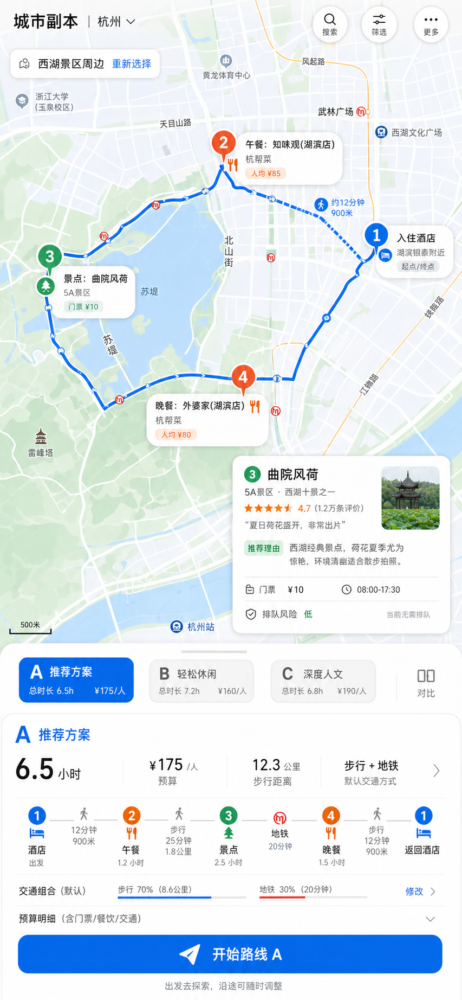
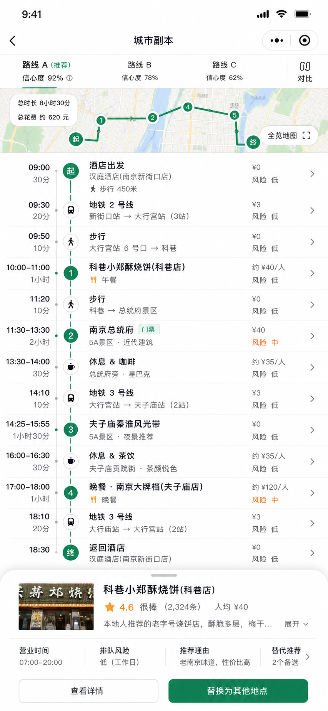
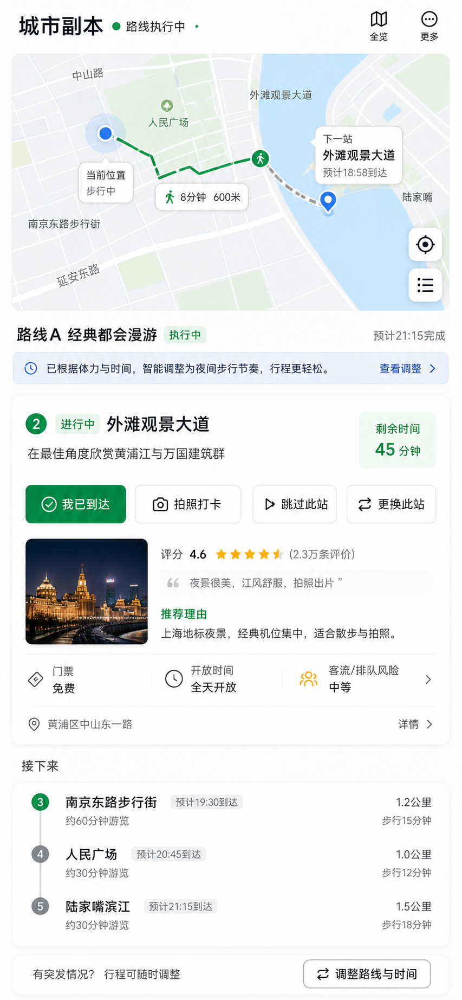

# 城市副本 UI 启发文档

## 1. 文档目的

这不是最终 UI 方案，也不是视觉规范。它只用于记录一些可以启发后续页面设计的产品形态、信息组织方式和交互模式。

后续真正设计页面时，仍然以 `docs/product-design.md` 为产品基准，以具体页面目标为准。

## 2. 总体 UI 气质

城市副本第一阶段是旅游用户使用的 Android App，界面应该优先满足户外场景下的可读性和可信度。

关键词：

- 地图先行。
- 信息解释充分。
- 操作路径短。
- 路线主推明确。
- 轻探索感，不重游戏化。
- 像熟悉当地情况的路线规划伙伴，不像点评榜单，也不像传统攻略。

视觉上应克制。重点不是做一个很炫的地图，而是让用户快速判断：这条路线从哪里到哪里、为什么这么走、每个点值不值得去、风险在哪里。

## 3. 可借鉴产品与启发点

### 高德地图 / 百度地图

借鉴点：

- 地图作为主画布，底部抽屉承载路线和地点详情。
- 用户对“地图 + POI 点位 + 路线线条”的认知成本低。
- 路线段信息需要明确标注步行、地铁、打车等交通方式。

不要照搬：

- 不要变成纯导航工具。
- 不要把路线 A 淹没在大量地图功能里。
- 不要把商户广告和榜单作为核心体验。

### Google Maps 地点详情

借鉴点：

- POI 点击后展开信息卡，先展示最关键的判断信息。
- 评分、营业时间、价格、照片适合组合成快速决策卡。
- 地点详情应允许用户继续查看，但第一屏必须已经能支持判断。

不要照搬：

- 不要让地点详情变成独立的信息黑洞。
- POI 卡必须解释“为什么它适合当前路线”，而不只是展示地点本身。

### Citymapper / Transit

借鉴点：

- 多交通方式组合的表达很清晰。
- 路线不是只有总耗时，而是拆成每一段。
- 换乘、步行、等待、到达时间都应该被明确表达。

不要照搬：

- 不要把界面做成通勤工具。
- 城市副本需要更多“地点体验解释”，不仅是交通效率。

### TripIt / 行程管理类产品

借鉴点：

- 时间线适合表达一天路线。
- 每个节点可以包含时间、地点、备注、费用、风险。
- 对旅游用户来说，行程顺序比复杂地图控制更重要。

不要照搬：

- 不要把产品做成手动行程表。
- 城市副本的关键是系统生成和解释路线，而不是用户自己排日程。

### Komoot / AllTrails

借鉴点：

- 路线执行过程中的进度感值得借鉴。
- 地图、当前点、下一步、路线完成状态需要结合。
- 路线可以有“完成感”，但不需要复杂游戏系统。

不要照搬：

- 不要过度偏户外运动。
- 不要把用户体力消耗和路线挑战做得太硬核。

### Airbnb 体验 / 旅行内容页

借鉴点：

- 适合学习“为什么值得去”的表达方式。
- 图片、地点氛围、注意事项和体验亮点可以帮助旅游用户建立信任。

不要照搬：

- 不要做成内容种草页。
- 不要让图片和文案压过路线执行信息。

### 小红书 / 马蜂窝 / 携程攻略

借鉴点：

- 用户熟悉“本地体验、拍照、避坑、推荐理由”的内容语言。
- 可以借鉴短句式的推荐理由和避坑提醒。
- 在无法稳定获取 UGC 数据时，可以作为外部跳转或搜索入口，而不是产品内核心数据源。

不要照搬：

- 不要做信息流。
- 不要做攻略瀑布流。
- 不要让用户重新陷入筛选大量笔记的负担。
- 不要抓取或伪造外部用户评价摘要。

## 4. 核心页面启发

### 地图选区页

目标是让用户快速确定“今天在哪一片区域玩”。

可借鉴结构：

- 地图为主。
- 顶部搜索城市、区县、酒店或地点。
- 地图上展示当前选区边界。
- 底部显示“当前区域可生成路线”的摘要。
- 主按钮是“下一步配置路线”。

设计注意：

- 不要一开始让用户填长表单。
- 地图层级要清晰，POI 不要过早铺满。

### 条件输入页

目标是让用户用很少的选择生成可用路线。

可借鉴结构：

- 分组筛选，而不是长表单。
- 默认值先填好，例如步行 + 地铁、路线 A 稳妥省心。
- 兴趣多选。
- 必去点支持搜索和地图添加。
- AI 对话输入后置为增强入口。

设计注意：

- 不要把所有高级条件都摊开。
- 必填项和可选项要清楚区分。

### 路线结果页

目标是让用户相信路线 A 可以直接走。

可借鉴结构：

- 第一屏先看到地图。
- 地图上展示路线 A 和关键 POI。
- 底部抽屉展示路线 A 摘要。
- 路线 B/C 用小入口呈现，作为备选。
- 时间线可以在抽屉展开后显示。

设计注意：

- 不要把 A/B/C 做成三个平级大卡片。
- 不要让用户先看文字再找地图。
- 路线 A 的“为什么推荐”必须明显。

### POI 详情弹窗

目标是让用户快速判断这个点是否值得去。

可借鉴结构：

- 顶部是地点名称、类型、评分。
- 第二层是推荐原因和当前路线适配理由。
- 第三层是价格、门票、营业时间、预计停留、排队风险。
- 底部提供替换此点、查看备选、加入必去点、跳转外部平台查看等操作。

设计注意：

- 不要只展示商家信息。
- POI 卡要回答“为什么是它，而不是别的点”。
- 外部 UGC 入口应是辅助按钮，不要压过路线解释。

### 路线执行 / 打卡页

目标是让用户边走边知道下一步做什么。

可借鉴结构：

- 顶部显示当前位置和下一站。
- 中部显示当前任务或打卡动作。
- 下方显示后续路线和时间变化。
- 提供到达确认、拍照打卡、跳过、替换当前点。
- 轻量收集路线反馈和 POI 体验反馈，作为自建 UGC 的来源。

设计注意：

- 游戏感要轻，不要过度徽章化。
- 执行页要优先服务安全、时间和方向判断。
- 反馈入口要顺手，不要打断用户继续走路线。

### Web 后台

目标是让运营和维护人员提高路线质量。

可借鉴结构：

- 左侧导航，右侧数据表和编辑面板。
- 城市、POI、标签、模板、反馈分区管理。
- 每条路线生成记录能查看输入条件、结果、失败原因和用户反馈。
- 查看自建 UGC 聚合结果，例如副本体验分、POI 体验标签、跳过和替换原因。

设计注意：

- 后台要偏工具化，不做营销风格。
- 数据表、筛选、状态和权限是核心。

### 产品介绍页

目标是说明城市副本是什么，并展示一条示例路线。

可借鉴结构：

- 第一屏直接展示产品名和示例路线地图。
- 说明“选区域，生成路线 A，边走边打卡”。
- 展示 POI 解释卡和路线反馈。
- 给等待名单、体验入口或 APK 下载入口。

设计注意：

- 不要做抽象 hero。
- 不要只讲概念，必须让用户看到真实路线样子。

## 5. 视觉方向启发

以下图片是早期探索素材，不是最终 UI 方案。它们用于启发信息层级、页面结构和交互重点，后续可以拆解吸收，不需要完整照搬。

### 方向 A：可信地图工具

界面像一个清晰、专业、轻量的地图产品。适合第一阶段。

特点：

- 白底或近白底。
- 地图占比高。
- 主色只用于路线 A、主按钮和选中态。
- 信息层级清楚，控件熟悉。

风险：

- 如果做得太普通，会像普通地图路线工具。
- 需要用 POI 解释和打卡反馈体现产品差异。

### 方向 B：旅游行程助手

界面像一个行程规划助手，地图和时间线并重。

特点：

- 时间、预算、风险提示更突出。
- 路线像一天行程，而不是单纯导航。
- 适合旅游用户理解节奏。

风险：

- 容易变成普通行程表。
- 需要保留系统生成路线的主推感。

### 方向 C：轻城市副本

界面带一点任务感和完成感，但仍然克制。

特点：

- 每个 POI 是一个路线节点，也可以是一个轻任务。
- 执行页有打卡、跳过、替换。
- 完成后有体验反馈和副本评分。

风险：

- 过度游戏化会降低旅游用户信任。
- 第一阶段不应展开复杂等级、徽章或排行榜。

## 6. 明确不做的 UI 方向

- 不做点评榜单式首页。
- 不做攻略信息流。
- 不做游戏大厅。
- 不做满屏活动 banner。
- 不做复杂社交动态。
- 不做每个信息块都独立成卡片的卡片墙。
- 不做只有漂亮图片但无法执行的旅行种草页。

## 7. 后续使用方式

后续页面设计可以从这里挑选启发，但不必照抄任何一个产品。

当前已确认的 Android App 页面设计基准见 `docs/page-design.md`。本文件继续作为参考方向和反例记录，不作为最终视觉规范。

建议优先组合：

- 地图选区页借鉴地图产品。
- 路线结果页采用地图优先 + 底部抽屉。
- 路线详情吸收时间线结构。
- POI 详情卡吸收地点详情与推荐理由。
- 执行页吸收轻打卡和路线进度。
- Web 后台采用稳定的管理工具布局。
